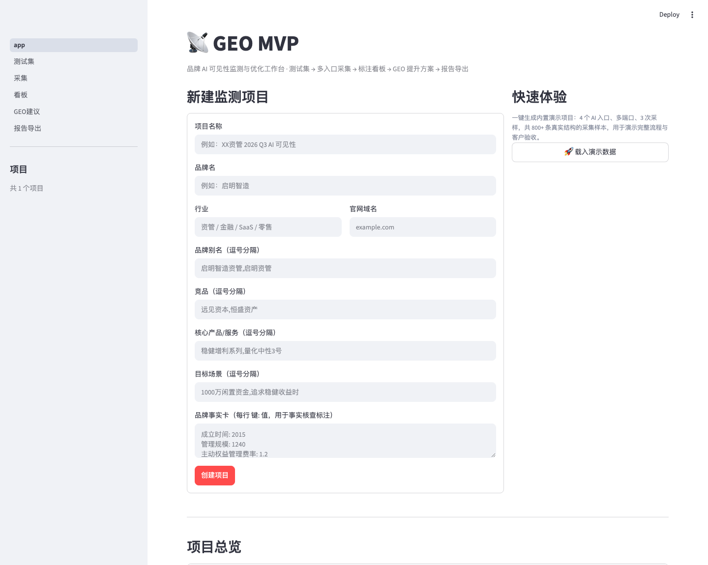
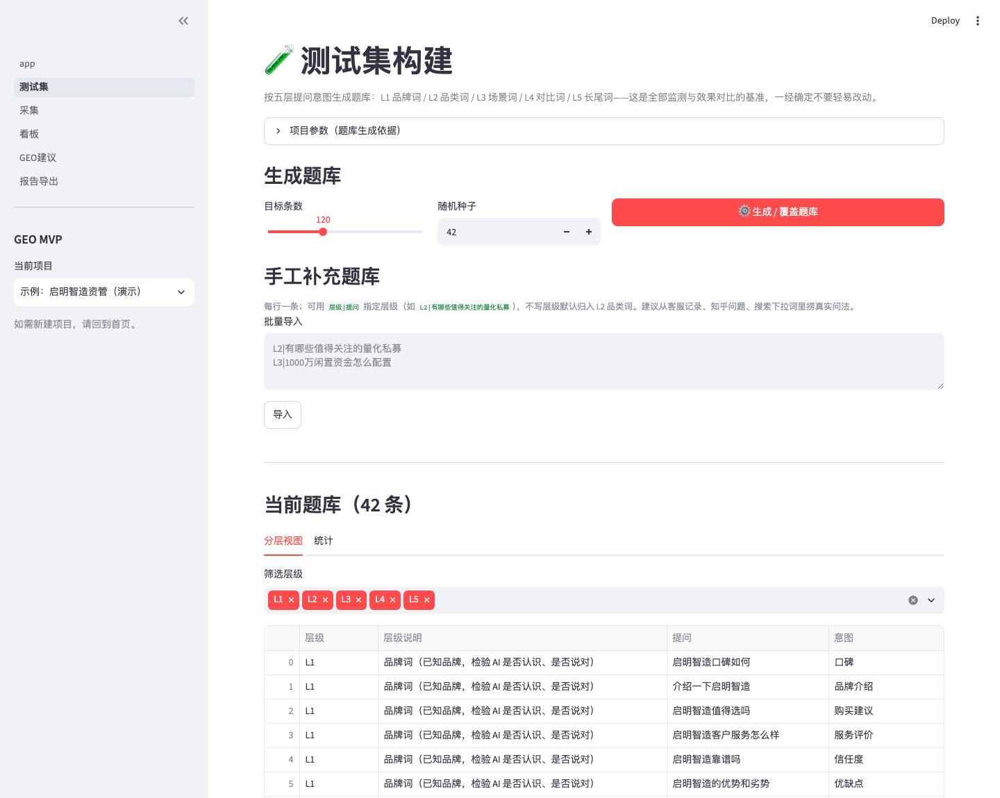
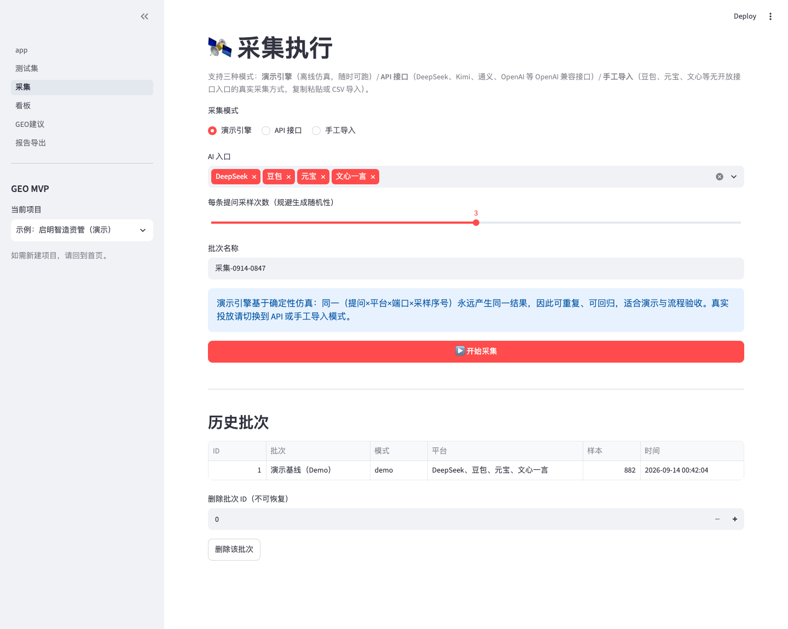
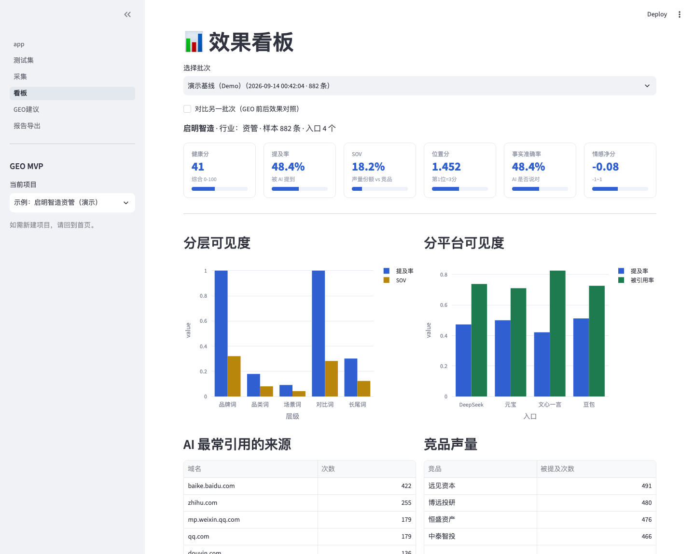
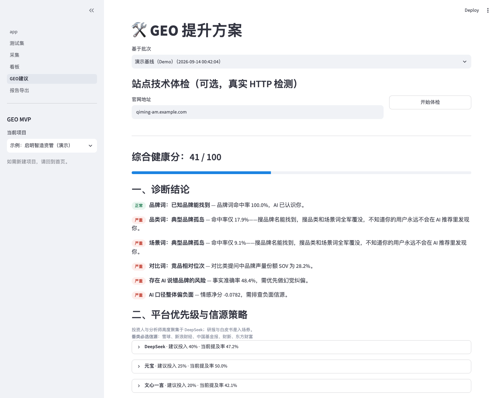
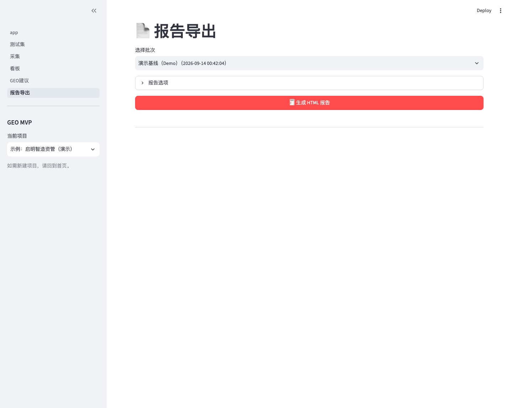

# GEO MVP · 品牌 AI 可见性监测与优化工作台

> 当用户问 AI「XX 品类有哪些推荐」时，你的品牌被提及了吗？排第几？说得对不对？
> **GEO MVP 是一套可以真实跑起来、交付客户验收的生成式引擎优化（GEO）工具**：
> 测试集构建 → 多入口采集 → 自动标注 → 效果看板 → GEO 提升方案 → HTML 报告导出，全链路闭环。



---

## 它解决什么问题

生成式引擎（DeepSeek / 豆包 / 元宝 / 文心一言 / ChatGPT…）正在取代搜索成为用户的第一问询入口。**没被 AI 提及 ≈ 该次决策中零曝光**。GEO（Generative Engine Optimization）就是让品牌内容在 AI 生成答案时「被选中、被引用、被说对」的工程化方法。

GEO MVP 把这件事做成了可运营的产品：

| 痛点 | GEO MVP 的回答 |
|---|---|
| 不知道 AI 现在怎么说我们 | 分层题库 × 多入口 × 多次采样的**基线监测** |
| AI 说的信息是错的（幻觉） | 对照品牌事实卡的**事实准确率标注**，定位需纠偏的回答 |
| 不知道差在哪、怎么改 | 六维指标看板 + 自动生成的**GEO 提升方案**（诊断结论/信源策略/内容改造样例） |
| 效果无法向老板/客户证明 | 固定题库定期重测，**批次对比** + 一键导出 HTML 验收报告 |

## 核心功能

### 1️⃣ 测试集构建（数据的自变量）

按五层提问意图生成题库——这是全部监测与效果对比的基准：

- **L1 品牌词**：已知品牌，检验 AI 是否认识你、是否说对（口碑/信任度）
- **L2 品类词**：「国内量化私募有哪些」——品类词曝光是 GEO 主战场
- **L3 场景词**：「1000 万闲钱怎么配置」——场景联想能力
- **L4 对比词**：「A vs B 哪个好」——竞品相对位次
- **L5 长尾问句**：从客服记录/知乎/搜索下拉词捞真实问法，支持手工批量导入

支持目标条数控制、随机种子固定（保证可复现）、手工补充导入。



### 2️⃣ 多入口采集探针

- 内置 **DeepSeek / 豆包 / 腾讯元宝 / 文心一言** 四大国内主流入口的采集通道
- 支持三种采集模式：**API 接入**（配置 Key 后自动跑）/ **手动录入**（复制粘贴 App 端回答）/ **演示数据**（一键生成 800+ 条真实结构样本）
- 每条 Prompt × 每个入口 × **多次采样**（应对生成随机性），记录端口与批次，模型升级后基线可比
- 探针以「中立、非个性化新会话」运行，规避平台 Memory RAG 的个性化偏差



### 3️⃣ 自动标注（数据的因变量）

每条回答按六维标注，LLM 自动初标 + 人工复核接口：

| 维度 | 含义 |
|---|---|
| 是否提及 | 回答中有没有我方（含品牌别名匹配） |
| 提及位次 | 我方排第几个被提及（1→3 分递减） |
| 是否挂引用 | 引用来源 URL 清单，我方域名占比 |
| 情感倾向 | 正/中/负 |
| **事实准确率** | 对照「品牌事实卡」判定 AI 说得对不对——幻觉纠偏的核心 |
| SOV 份额 | 我方提及 ÷（我方+竞品提及） |

### 4️⃣ 效果看板

六维 KPI 卡（健康分/提及率/SOV/位置分/事实准确率/情感净分）+ 分层可见度 + 分平台可见度 + AI 最常引用来源 + 竞品声量对比，支持**批次对比**（GEO 前后效果对照）。



### 5️⃣ GEO 提升方案（服务交付的抓手）

基于标注数据自动生成诊断与行动方案：

- **诊断结论**：品牌词/品类词/场景词/对比词逐层命中判定，标出「品牌孤岛」病灶
- **平台优先级与信源策略**：按各入口信源偏好给出投入配比建议（如 DeepSeek 重视权威媒体、豆包重视字节系生态）
- **内容改造样例**：before/after 对照——如何把一条普通内容改成「易被 AI 引用」的写法（结论前置+统计数据+标注来源）
- **幻觉纠偏清单**：列出 AI 说错的事实与对应的可信信源投放建议
- **站点技术体检**（可选，真实 HTTP 检测）：AI 爬虫 robots 协议、llms.txt、结构化数据检查



### 6️⃣ 报告导出

一键生成自包含 HTML 报告（可发客户/老板），含指标总览、分层/分平台明细、诊断与行动方案。



## 快速开始

```bash
pip install -r requirements.txt
streamlit run app.py
```

打开 http://localhost:8501，首页点击 **「🚀 载入演示数据」** 即可获得一个完整演示项目
（虚构品牌「启明智造资管」：4 个入口 × 42 条题库 × 3 次采样 = 882 条样本），
然后依次走完 测试集 → 看板 → GEO建议 → 报告导出 全流程。

### 真实使用（三步接入）

1. **建项目**：首页填写品牌名、别名、竞品、核心产品、**品牌事实卡**（用于事实核查）
2. **建题库**：测试集页按五层生成 + 手工补充真实问法
3. **采集**：三种模式任选——
   - 有 API Key：配置后自动采集（DeepSeek 等开放 API 的入口）
   - 无 API：采集页复制入口 App/Web 的回答文本手动录入，或用 CSV 批量导入
   - 之后每周同题库重测，看板页用「批次对比」看趋势

## 技术架构

```
geo-mvp/
├── app.py                  # Streamlit 主入口（项目管理 + 演示数据）
├── pages/
│   ├── 1_测试集.py          # 五层题库生成/导入/管理
│   ├── 2_采集.py            # 探针采集（API/手动/CSV 批量）
│   ├── 3_看板.py            # 六维指标 + 批次对比
│   ├── 4_GEO建议.py         # 诊断引擎 + 站点技术体检
│   └── 5_报告导出.py        # 自包含 HTML 报告
└── geo_mvp/
    ├── db.py               # SQLite 数据层（项目/题库/批次/回答/标注）
    ├── prompts.py          # 五层题库生成器（随机种子可复现）
    ├── probes.py           # 多入口采集探针（API/手动/演示）
    ├── annotate.py         # 标注引擎（提及/位次/引用/情感/事实核查）
    ├── metrics.py          # 指标计算（SOV/健康分/位置分）
    ├── advisory.py         # GEO 诊断与建议引擎
    ├── tech.py             # 站点技术体检（robots/llms.txt/Schema）
    ├── report.py           # HTML 报告渲染
    ├── seed_demo.py        # 演示数据种子
    └── ui.py               # 共享 UI 组件
```

- **存储**：SQLite 单文件（`data/geo_mvp.db`），零部署依赖
- **界面**：Streamlit + Plotly
- **设计原则**：采集层可插拔（API / 手动 / 屏幕抓取均可接入）、标注口径可复核（事实卡锚点）、批次可比（固定题库+记录端口与采样数）

## 方法论说明（如实声明）

- 演示项目中的回答文本为**结构演示数据**（非真实模型输出），用于跑通流程与客户验收演示；接入真实 API Key 后即为真实采集
- GEO 是**概率提升 + 持续迭代**：单次采样有随机性，本工具通过多次采样、固定题库、批次对比来控制方差，看 4 周移动平均而非单点
- 优化建议仅覆盖**白帽手段**（内容质量、信源布局、结构化数据）；任何「投喂/注入 AI」式黑灰产手段不在本工具范围内（2026 年 3·15 已曝光此类产业链，金融机构尤其勿碰）

## 路线图

- [x] MVP：五层题库 / 四入口采集 / 六维标注 / 看板 / 建议引擎 / HTML 报告
- [ ] 接入 OpenAI 兼容 API 的自动标注（当前为规则+关键词基线版）
- [ ] 屏幕抓取采集器（模拟真实用户，解决无 API 入口）
- [ ] 多项目/多租户与权限
- [ ] 定时重测调度 + 邮件/IM 通报

## License

MIT
